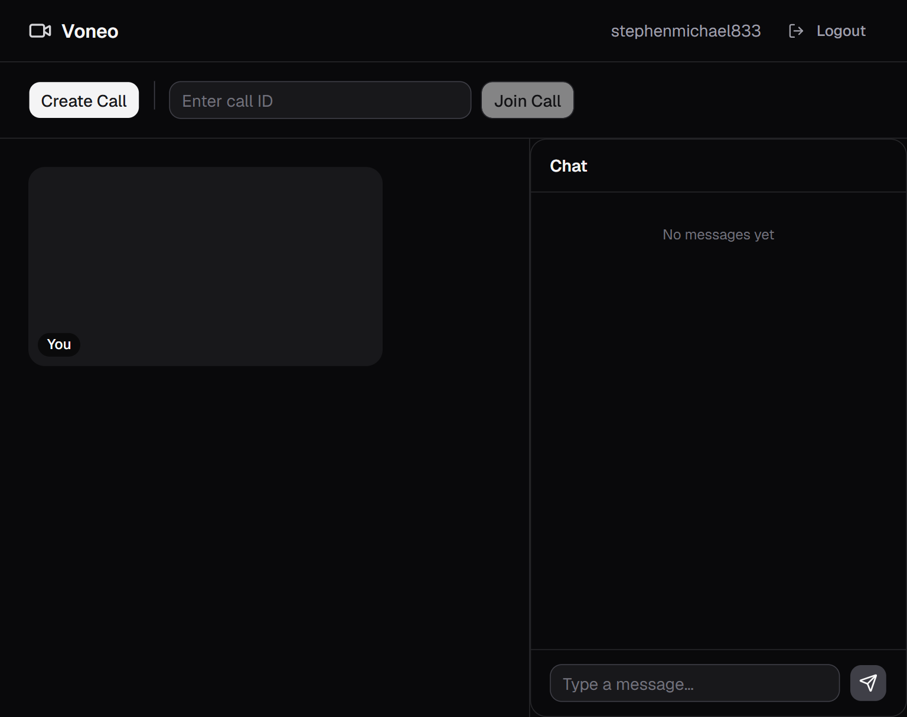

# Note: WORK IN PROGRESS

# Voneo - P2P Video Chat Web App



[](https://nodejs.org/)
[](https://expressjs.com/)
[](https://developer.mozilla.org/en-US/docs/Web/API/WebSockets_API)
[](https://webrtc.org/)
[](https://www.sqlite.org/)
[](https://sequelize.org/)
[](https://jwt.io/)
[](https://developer.mozilla.org/en-US/docs/Web/JavaScript)
[](https://developer.mozilla.org/en-US/docs/Web/HTML)
[](https://astro.build/)
[](https://react.dev/)
[](https://ui.shadcn.com/)
[](https://tailwindcss.com/)
[](https://cloud.google.com/)
[](https://github.com/xojs/xo)
[](https://prettier.io/)
[](https://playwright.dev/)
[](https://vitest.dev/)
[](https://github.com/visionmedia/supertest)
[](https://www.typescriptlang.org/)
[](https://www.pulumi.com/)
[](https://www.docker.com/)

A peer-to-peer video chat application built with an Astro/React frontend and a Node.js signalling stack. Users authenticate then create or join calls through an Express.js API, which provisions per-call WebSocket servers for session coordination. WebRTC handles media between peers once signalling completes.

## Overview

This project demonstrates a classic WebRTC architecture: an HTTP API and WebSocket layer for **signalling** (call creation, join/leave, SDP offers, chat), and the browser for **media** (camera/microphone via `getUserMedia`, peer connections via `RTCPeerConnection`).

Typical flow:

1. A user opens the app, authenticates (login or register), then creates a call or joins one with a call ID.
2. The Express API spins up a dedicated WebSocket server for that call and returns its URL.
3. The client connects to that WebSocket server and exchanges signalling messages (participants, offers, chat).
4. WebRTC negotiation runs in the browser (`rtcUtils.ts`) to establish P2P video/audio where implemented.

## Project Structure

```
video-chat-application/
├── web-socket-api/              # Express.js signalling API + per-call WebSocket servers
│   └── src/
│       ├── app.js               # API entry point (port 3000 by default)
│       ├── openapi.yaml         # API schema reference (may drift from implementation)
│       ├── Dockerfile           # Production Docker image for the signalling API
│       ├── compose.yaml         # Docker Compose services (dev)
│       ├── authorization/       # Signup, login, logout, reset token provision routes
│       ├── call/                # Create / join / leave call routes + WS utilities
│       │   ├── controller.js
│       │   ├── routes.js
│       │   └── utils/           # Session store, WebSocket server, misc helpers
│       ├── common/              # DB config (SQLite), models, JWT middleware
│       │   ├── database.js
│       │   ├── middlewares/     # Auth, permission checks, token handling
│       │   └── models/          # User, Call, CallParticipants, RefreshToken
│       └── storage/             # SQLite DB files (data.db, example.data.db)
│   └── tests/
│       ├── it/                  # Integration tests
│       └── unit/                # Unit tests (Backend utiities, i.e. token generators, helper utils)
├── web-server/                  # Astro.js frontend (SSR, React + Tailwind + shadcn/ui)
│   ├── Dockerfile               # Production Docker image — serving the built Astro SSR app
│   ├── Dockerfile.dev           # Dev Docker image — mounts source and watches for changes
│   ├── compose.yaml             # Docker Compose services (prod + dev)
│   ├── public/
│   │   └── token-worker.js      # Web Worker: token storage + all API fetch calls
│   ├── tests/                    
│       ├── component/           # Component tests, i.e. validating interactive components respond to user
│   └── src/
│       ├── pages/
│       │   └── index.astro      # Shell page — imports global CSS, renders <App client:load />
│       ├── components/
│       │   ├── App.tsx          # Root — switches between AuthScreen / CallScreen
│       │   ├── AuthScreen.tsx   # Login + register tabs (shown when logged out)
│       │   ├── CallScreen.tsx   # Create/join call controls, video grid, chat sidebar
│       │   ├── VideoGrid.tsx    # Local + remote video tiles
│       │   ├── ChatPanel.tsx    # Chat message list + send input
│       │   └── ui/              # shadcn/ui primitives
│       ├── lib/
│       │   ├── rtcUtils.ts      # WebRTC helpers (media, peer connections, WS messaging)
│       │   ├── useTokenWorker.ts # Hook — module-level singleton Worker
│       │   └── utils.ts         # shadcn cn() class utility
│       ├── styles/
│       │   └── global.css       # Tailwind v4 + shadcn CSS variable theme
│       └── middleware.ts        # CSP header (nonce-based, skipped in dev mode)
├── infra/                       # Pulumi (TypeScript) IaC — provisions GCP resources (Cloud Run service, Cloud SQL instance, Secret Manager secrets) for production deployments
├── e2e/                         # End-to-end tests (Playwright)
├── .github/workflows/           # CI/CD workflows
├── .husky/                      # Git hooks
├── package.json                 # Root scripts to run both servers
└── playwright.config.ts         # Playwright configuration
```


| Component                             | Role                                                                                       |
| ------------------------------------- | ------------------------------------------------------------------------------------------ |
| **Express.js API** (`web-socket-api`) | REST signalling: auth, users, call lifecycle; creates in-memory WebSocket servers per call |
| **Astro frontend** (`web-server`)     | SSR Astro app with React components, Tailwind CSS, and shadcn/ui; port **4321** in dev     |


## Local Setup

### Prerequisites

- [Node.js](https://nodejs.org/) (LTS recommended)
- Git
- A machine with camera/microphone access for testing WebRTC

### 1. Clone and install API dependencies

```bash
git clone <repository-url>
cd video-chat-application
cd web-socket-api
npm install
```

### 2. Run the Express signalling API

From the `web-socket-api/src` directory:

```bash
npm run dev
```

Default: `http://<HOST>:3000` (`3000` is fallback if `NODE_ENV` environment variable not provided via `web-socket-api/src/.env` ).

Alternatively, from the repo root:

```bash
npm run run-signalling-api
```

Or using the Docker dev image (from `web-socket-api/src/`):

```bash
docker compose up web-socket-api-dev
```

This mounts the source directory and watches for changes, so no rebuild is needed during development.

### 3. Run the Astro frontend

From the `web-server` directory:

```bash
cd ../web-server
npm run dev
```

App URL: **[http://localhost:4321/](http://localhost:4321/)**

From the repo root:

```bash
npm run run-video-chat-frontend
```

Or using the Docker dev image (from `web-server/`):

```bash
docker compose up web-server-dev
```

This uses `Dockerfile.dev` and syncs local file changes into the container automatically.

**Production image:** `Dockerfile` produces a production-optimised image (`voneo-web-server`). This image is used in GCP deployments — it is pushed to Artifact Registry and referenced by the Cloud Run service provisioned via the Pulumi stack in `infra/`.

---

## Signalling Server (Express.js API)

**Base URL:** `http://localhost:3000` (or the host/port configured in `web-socket-api/app.js`)

**Database:** SQLite at `web-socket-api/storage/data.db` (created on first run via Sequelize `sync()`)
<br><br>
<i>Note:</i> To use test DB copy `example.data.db` and rename to `data.db` before spinning up API for first time.

### API Routes

#### Auth (`/`)


| Method | Path      | Auth | Request body                                                                          | Success response                                                                       |
| ------ | --------- | ---- | ------------------------------------------------------------------------------------- | -------------------------------------------------------------------------------------- |
| `POST` | `/signup` | No   | `{ "username": string (min 3), "email": string (email), "password": string (min 6) }` | `201` — `{ "success": true, "data": {"message": "Succesful sign up"}}` |
| `POST` | `/login`  | No   | `{ "email": string (email), "password": string (min 6) }`                             | `200` — `{ "success": true, "data": { "accessToken": "<jwt>"}}`                        |
| `POST` | `/logout` | Yes  | —                                                                                     | `200` — `{ "success": true, "data": {"message": "Logged out succesfully"}}`           |
| `POST` | `/refresh` | Yes | —                                                                                     | `200` — `{ "success": true}`                                                           |


**Signup errors:** 

- `400` — invalid body: `{ "success": "false", "data": { "message": "Invalid credentials"}}`
- `500` — server error: `{ "success": false, "data": { "message": "Server error" } }`

**Login errors:**

- `400` — invalid body: `{ "success": "false", "data": { "message": "Invalid credentials" }}`
- `500` — server error: `{ "success": false, "data": { "message": "Server error" } }`

**Logout errors:**
- `500` — server error: `{ "success": "false", "data": { "message": "Server error" } }`

**Refresh errors:**
- `401` — invalid/expired refresh token: `{ "success": "false", "data": { "message": "Invalid or expired refresh token" }}`
- `500` — server error: `{ "success": "false", "data": { "message": "Server error" } }`

#### Calls (`/call`)


| Method | Path                  | Auth | Request                                                 | Success response                                                                     |
| ------ | --------------------- | ---- | ------------------------------------------------------- | ------------------------------------------------------------------------------------ |
| `POST` | `/call/create`        | Yes  | —                         | `201` — `{ "success": true, "data": { "callID": "<uuid>", "callURL": "ws://..." } }` |
| `PUT`  | `/call/:callID/join`  | Yes  | Params: `callID` (UUID) | `200` — `{ "success": true, "data": { "callURL": "ws://..." }}`                     |
| `DELETE`  | `/call/:callID/leave` | Yes  | Params: `callID` (UUID)                                               | `200` — `{ "success": true, "data": { "message": "Succesfully left call" }}`                                                                     |
| `POST`  | `/call/:callID/messages` | Yes  | Params: `callID` (UUID)                                               | `201` — `{ "success": true, "data": { "message": "Message sent to all call participants succesfully" }}`   


**Call errors (examples):**

- `400` — invalid body/params: `{ "success": false, "error": "Invalid input", "details": [...] }`
- `404` — unknown call: `{ "success": false, "error": "Call ID not present" }`
- `500` — server error: `{ "success": false, "error": "<message>" }`

Creating a call also starts a **WebSocket server** on a random port and stores session state in an in-memory `Map` (`callId` → `{ wsURL, participants, pendingParticipants }`).

### Authentication

Protected routes expect a JWT in the `Authorization` header:

```
Authorization: Bearer <token>
```

Tokens are issued on successful **login** (`POST /login`). Secrets for creating access and refresh token JWTs is provided via `.env`, expirys for both are defined in `common/middlewares/tokens.js`.

### WebSocket signalling (per call)

After `create` or `join`, clients connect to `callURL` and send JSON messages, for example:


| Client → server `type` | Purpose                                                         |
| ---------------------- | --------------------------------------------------------------- |
| `newParticipantOnCall` | Announce join; server replies with participants / notifications |
| `chatMessage`          | Broadcast chat                                                  |
| `offer`                | Relay WebRTC offer to a named recipient                         |


| Server → client `type`                   | Purpose                     |
| ---------------------------------------- | --------------------------- |
| `receivedNewParticipantNotif`            | Someone joined              |
| `responseCurrentCallParticipants`        | List of peers to connect to |
| `offer`                                  | Forwarded SDP offer         |
| `chatMessage` / `receivedNewChatMessage` | Chat payloads               |


### API examples

In `example.data.db`, the following users have been defined for testing:

```json                                    
{
  username: john2739
  email: john.smith@gmail.com 
  password: ExamplePassword123
}
```
```json
{
  username: sam8282
  email: sam.clarence@gmail.com 
  password: ExamplePassword456
}
```

**Register a user**

```bash
curl -X POST http://localhost:3000/signup \
  -H "Content-Type: application/json" \
  -d '{"username":"alice","email":"alice@example.com","password":"secret12"}'
```

**Login**

```bash
curl -X POST http://localhost:3000/login \
  -H "Content-Type: application/json" \
  -d '{"email":"alice@example.com","password":"secret12"}'
```

**Create a call**

```bash
curl -X POST http://localhost:3000/call/create \
  -H "Authorization: Bearer YOUR_ACCESS_TOKEN" \
  -H "Content-Type: application/json" \
```

**Join an existing call**

```bash
curl -X POST http://localhost:3000/call/a1b2c3d4-e5f6-7890-abcd-ef1234567890/join \
  -H "Authorization: Bearer YOUR_ACCESS_TOKEN" \
  -H "Content-Type: application/json" \
```

**Leave a call**

```bash
curl -X POST http://localhost:3000/call/a1b2c3d4-e5f6-7890-abcd-ef1234567890/leave \
  -H "Authorization: Bearer YOUR_ACCESS_TOKEN" \
  -H "Content-Type: application/json" \
```

For a machine-readable spec, see `web-socket-api/src/openapi.yaml` (some paths/responses may not match runtime behavior yet).


### Environment Variables

In order to sign JWT access and reset tokens, the API requires a `.env` to define the following environment variables:

```ini
JWT_SECRET=thesecret
REFRESH_TOKEN_SECRET=anothersecret
NODE_ENV=dev
```

This should be defined in the `src/` directory in order for the `dev` command to spin up the server to provide these variables.
`NODE_ENV` can be set to either `dev` or `production`, setting `production` ensures refresh token cookie can only be sent over secure `HTTPS` connections (sets `Secure` property to `true`).

A `.env.example` file has been defined using these defaults for local tesing.

---

## Frontend (Astro + React)

**Framework:** Astro (SSR via `@astrojs/node`), port **4321** in dev (`npm run dev` from `web-server/`).

**Entry:** `src/pages/index.astro` imports global CSS and renders `<App client:load />`.

### `useTokenWorker.ts`

Hook that wraps the `token-worker.js` Web Worker. The Worker instance is a **module-level singleton** so all components share the same instance and the token stored after login is available to subsequent calls. Exposes: `login`, `register`, `logout`, `createCall`, `joinCall`.

### `token-worker.js`

Plain JS Web Worker served from `public/`. Owns the `TokenService` class which holds the JWT access token in a private field. Handles all `fetch` calls to the Express API so the token never touches the main thread.

### CSP middleware (`src/middleware.ts`)

Sets a nonce-based `Content-Security-Policy` header on every response in production. Skipped in dev mode to avoid blocking Vite's HMR and dev toolbar scripts. Directives cover `script-src`, `worker-src`, `connect-src` (API + WebSocket), `media-src`, `style-src`, `img-src`, `object-src`, and `base-uri`.

---

## Gotchas & Experimentation

1. **API working directory** — SQLite path is `./storage/data.db` relative to where `app.js` is started; prefer running from `web-socket-api/`.
2. **Incomplete endpoints** — `DELETE /call/:callID/leave` is a stub. Do not expect leave-call to work at current
3. **In-memory calls** — Restarting the API clears all active calls and WebSocket servers. No persistence of web socket calls to persistent storage at current.

